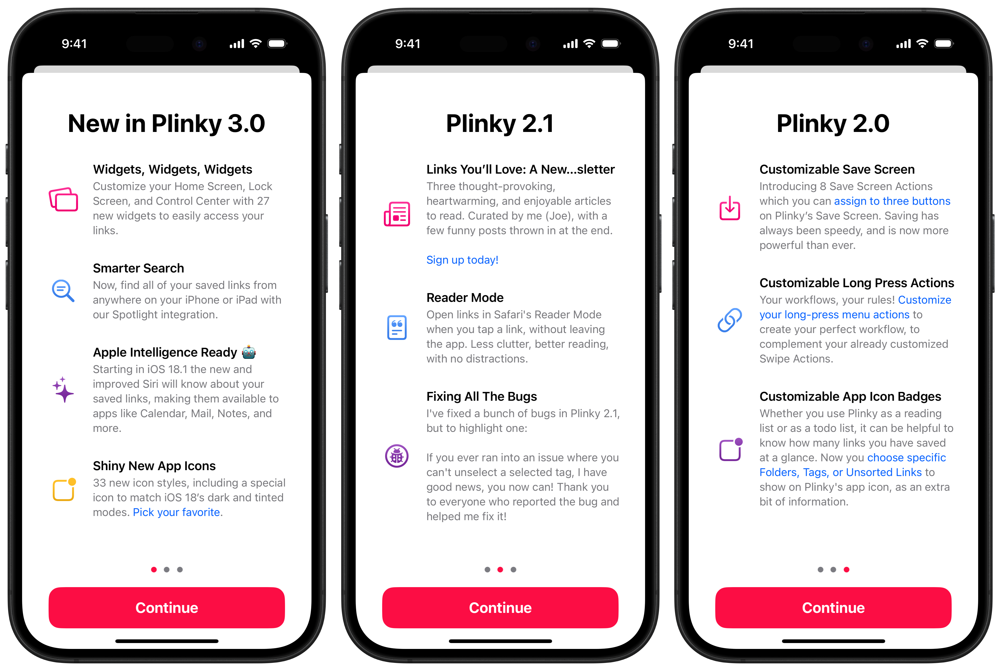
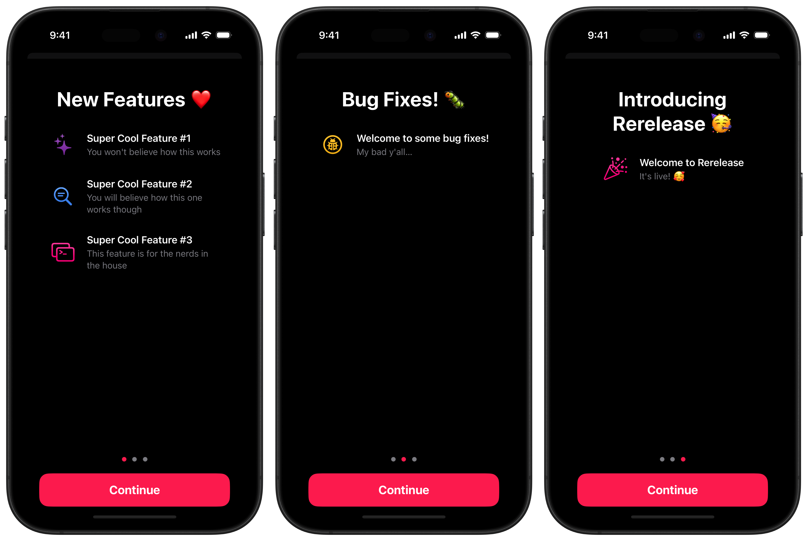

# Recap

#### A "What's New" Screen, with a few tricks up it's sleeve.



### What’s New? Nm, what’s new witchu?

- **Flexible release history**: Unlike most What's New Screen libraries, Recap can display multiple releases, showcasing your app's entire feature history.

- **No code, no problems**: Powered by a simple Markdown file, stored locally or loaded remotely.

- **Built-in customization**: Presents a beautiful, standardized interface out of the box, while offering full customization to match any app's design language.

- **Semantic versioning support**: Simple logic to help decide when to display your What's New Screen.

### Getting Started

Setting up a screen to display your app's releases is simple:
1. Create a markdown file with your releases (we'll cover the format later).
2. Add two lines of code.

```swift
// Initialize releases from a markdown file in your app's bundle
extension [Release] {
    static var appReleases: [Release] {
        ReleasesParser(fileName: "Releases").releases
    }
}

// Create and display the RecapScreen
RecapScreen(releases: .appReleases)
```

That's all you need to get started!

### Creating Releases

Your releases are defined in a simple markdown file, with a very simple spec:
```markdown
# Version Number: [String] (Supports arbitrary number formats such as 1, 1.0, or 1.0.0)
## Release Title: [String]
### Semantic Version Change Type: [Major | Minor | Patch]

- title: [String] (Feature Title)
- description: [String] (Feature Description)
- symbol: [String] (SF Symbol Identifier)
- color: [String] (Hex Color Code or System Color Name)
```

> [!NOTE]
> For a full list of supported System Color Names, see `Sources/Recap/Internal/Color+SystemNames.swift`.

#### Example Releases file

```markdown
# 1.1
## New Features ❤️
### Minor

- title: Super Cool Feature #1
- description: You won't believe how this works
- symbol: sparkles
- color: cyan

- title: Super Cool Feature #2
- description: You will believe how this one works though
- symbol: text.magnifyingglass
- color: blue

- title: Super Cool Feature #3
- description: This feature is for the nerds in the house
- symbol: apple.terminal.on.rectangle
- color: orange

# 1.0.1
## Bug Fixes! 🐛
### Patch

- title: Welcome to some bug fixes!
- description: My bad y'all…
- symbol: ladybug.circle
- color: #FFC933

# 1.0
## Introducing Recap 🥳
### Major

- title: Welcome to Recap
- description: It's live! 🥰
- symbol: party.popper
- color: #F72585
```

With just a few lines of markdown we've built a Releases screen that has three pages, with a consistent look and feel.



### Customize Your Release Screen

Recap provides various modifiers to tailor the Releases screen to your app's visual identity:

```swift
// Available customization modifiers
func recapStartIndex(_ startIndex: RecapScreenStartIndex) -> some View
func recapTitleStyle(_ style: some ShapeStyle) -> some View
func recapDismissButtonStyle(_ style: some ShapeStyle) -> some View
func recapDismissButtonStyle(_ backgroundStyle: some ShapeStyle, _ foregroundStyle: some ShapeStyle) -> some View
func recapIconFillMode(_ style: IconFillMode) -> some View
func recapPageIndicatorColors(selected: Color, deselected: Color) -> some View
func recapBackground(_ style: AnyShapeStyle?) -> some View
func recapBackground(_ color: Color) -> some View
func recapPadding(_ insets: EdgeInsets) -> some View
func recapHeaderSpacing(_ spacing: CGFloat) -> some View
func recapItemSpacing(_ spacing: CGFloat) -> some View
func recapDismissAction(_ dismissAction: (() -> Void)?) -> some View
```

Example usage:

```swift
RecapScreen(releases: .appReleases)
    .recapScreenTitleStyle(LinearGradient(colors: [.purple, .pink, .orange, .yellow], startPoint: .topLeading, endPoint: .bottomTrailing))
    .recapScreenDismissButtonStyle(Color.pink, Color.white)
    .recapScreenIconFillMode(.gradient)
    .recapScreenPageIndicatorColors(
        selected: Color.pink,
        deselected: Color.gray
    )
```

RecapScreen also supports leading and trailing views:

```swift
RecapScreen(
    releases: .plinkyReleases
    leadingView: {
        UpcomingRoadmapView()
    }, trailingView: {
        SupportView()
    }
)
.recapScreenStartIndex(.release())
// Alternatively: .recapScreenStartIndex(.leadingView) or .recapScreenStartIndex(.trailingView)
```

In my app [Plinky](https://plinky.app), I use the leading view to display the app's upcoming roadmap ahead of the most recent features, and the trailing view displays a support screen for people to reach out to me after browsing the feature list.

### Semantic Versioning

Recap includes a `SemanticVersion` type, to help determine when to display the What's New Screen. Here's an example of how to use it:

Recap bundles a useful utility for choosing when to display the What's New Screen. You can use `SemanticVersion` to compare your app's current version to the last launched version, to decide if you should show the What's New Screen. I recommend tailoring the logic to your needs, but this is a basic example of how it can be used.

```swift
var shouldDisplayRecapScreen: Bool {
    let currentVersionString = Bundle.main.object(forInfoDictionaryKey: "CFBundleShortVersionString") as? String
    let previousVersionString = "1.0.0" // You should decide the best way to store the user's last launched version number, UserDefaults is a useful option.

    guard let currentVersionString else { return false }
    guard let previousVersionString else { return false }

    let currentVersion = SemanticVersion(version: currentVersionString)
    let previousVersion = SemanticVersion(version: previousVersionString)

    // Show screen if major or minor version has increased
    return currentVersion.major > previousVersion.major || currentVersion.minor > previousVersion.minor
}
```

This logic displays the RecapScreen when:
- Upgrading from 1.0.0 to 1.1.0
- Upgrading from 1.0.0 to 2.0.0
- But not when upgrading from 1.0.0 to 1.0.1

### Demo

Try Recap with [the demo project](https://github.com/mergesort/Recap/tree/main/Demo) to see if it fits your app's needs. 📱

### Requirements

- iOS 17.0+
- Xcode 14+

### Installation

#### Swift Package Manager

The [Swift Package Manager](https://www.swift.org/package-manager) is a tool for automating the distribution of Swift code and is integrated into the Swift build system.

Once you have your Swift package set up, adding Recap as a dependency is as easy as adding it to the dependencies value of your `Package.swift`.

```swift
dependencies: [
    .package(url: "https://github.com/mergesort/Recap.git", .upToNextMajor(from: "1.0.0"))
]
```

#### Manually

If you prefer not to use SPM, you can integrate Recap into your project manually by copying the files in.

---

### About me

Hi, I'm [Joe](http://fabisevi.ch) everywhere on the web, but especially on [Threads](https://threads.net/@mergesort).

### License

See the [license](LICENSE) for more information about how you can use Recap.

### Sponsorship

Recap is a labor of love to help developers build better apps, making it easier for you to unlock your creativity and make something amazing for your yourself and your users. If you find Recap valuable I would really appreciate it if you'd consider helping [sponsor my open source work](https://github.com/sponsors/mergesort), so I can continue to work on projects like Recap to help developers like yourself.
